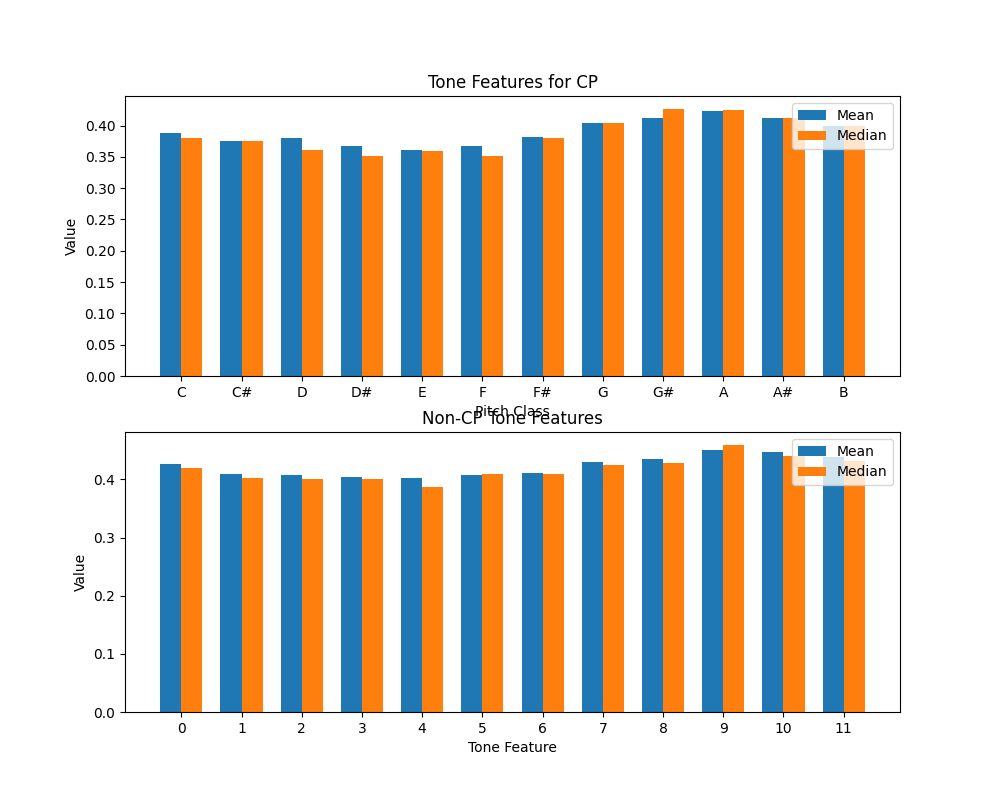
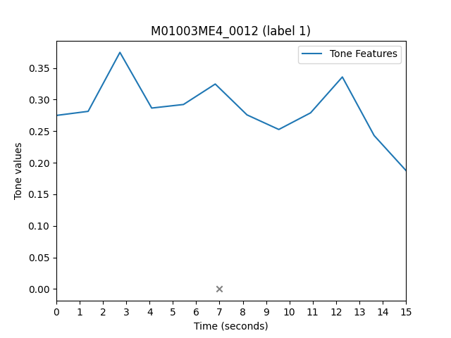
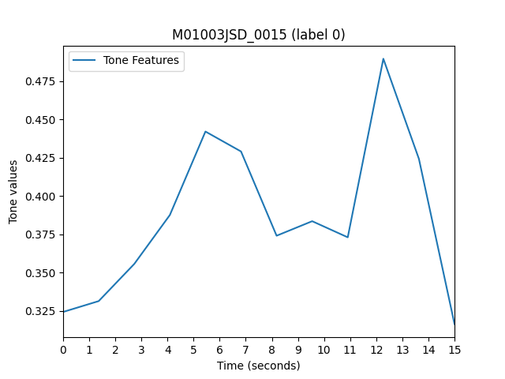

## Usage 

Extract the audio tone from a single segment
```
python extract_audio_tone.py
```


Bar plot for a sampled balanced set of audio segments regarding the tone features
```
python full_extract_audio_tone.py
```

<figure>
  
  <figcaption>Expected output using tonnetz features</figcaption>
</figure>

<figure>
  
  <figcaption>Expected output using chroma features</figcaption>
</figure>

<figure>
  
  <figcaption>Expected output using spectral_contrast features</figcaption>
</figure>

<figure>
  
  <figcaption>Expected output using mfcc features</figcaption>
</figure>

Visualize the types of features (audio emotional features/tone features)
```
sh visualize_features.sh
```



