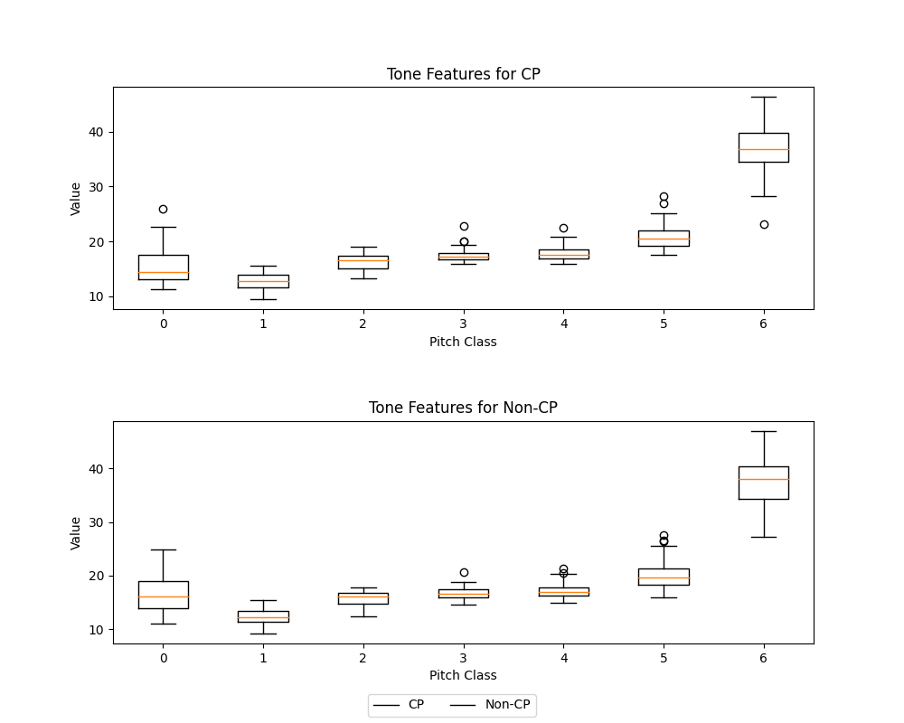

## Usage 

Extract the audio tone from a single segment
```
python extract_audio_tone.py
```
<figure>
  <figcaption>Expected tone plot</figcaption>
  
</figure>

Bar plot for a sampled balanced set of audio segments regarding the tone features
```
python full_extract_audio_tone.py
```

<figure>
  <figcaption>Expected output using tonnetz features</figcaption>
  
</figure>

<figure>
  <figcaption>Expected output using chroma features</figcaption>
  
</figure>

<figure>
<figcaption>Expected output using spectral_contrast features</figcaption>
  
</figure>

<figure>
    <figcaption>Expected output using mfcc features</figcaption>
  
</figure>

<figure>
    <figcaption>Expected output using zero_crossing_rate features</figcaption>
  
</figure>

Visualize the types of features (audio emotional features/tone features) per timestamp-level
```
sh visualize_features.sh
```
<figure>
    <figcaption>Expected loudness output for CP segment</figcaption>
  
</figure>

<figure>
    <figcaption>Expected loudness output for non-CP segment</figcaption>
  
</figure>
